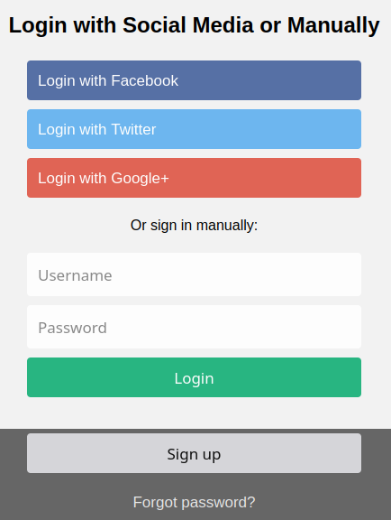
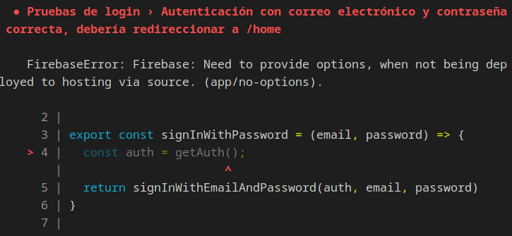

# Workshop Testing Social Network

En este repositorio encontrarás un ejemplo de prueba unitaria para el proyecto social network de Laboratoria.

## Primeros pasos

1. Haz un fork de este repositorio
2. Clona tu repositorio
3. Instala las depedencias con `npm install`
4. Inicia la aplicación con `npm start`
5. Ejecuta la aplicación en un navegador web ingresando a `http://localhost:5173/`
6. Si todo salio bien, deberías ver en el navegador la siguiente interfaz:


_Nota: La vista es responsive por lo que puede variar según el tamaño de tu pantalla_

7. Ya estas lista para iniciar este taller.

## Explora la aplicación

Tómate unos minutos para explorar la aplicación.

En esta aplicación solo se ha implementado el login y registro por Google o correo electrónico, junto con un ruteador para que cada vista tenga una url.  Puedes crear una cuenta con correo electrónico y contraseña haciendo clic en el botón "Sign up" o usando Google haciendo clic en el botón "Google+". Una vez crees una cuenta, intenta iniciar sesión. También fíjate en cómo cambia la URL del navegador cuando se muestra una vista nueva de aplicación. Usa los botones de `atras` y `adelante` del historial del navegador y fíjate cómo cambia la URL y se carga la vista correspondiente. Finalmente verifica que cuando se inicia sesión correctamente el usuario es redireccionado a la URL `/home` y cuando hay un error en la autenticación se muestra un modal con detalles.


## Explora el código

Tómate unos minutos para explorar el código y entender cómo funciona.

### Ruteador

El archivo `index.html` hace uso del archivo `main.js`. Este archivo ejecuta la función `initFirebase` para inicializar Firebase y la función `initRouter` para incializar el ruteador. 

```js
// Initialize Firebase
initFirebase();

// Initialize Router
initRouter(ROUTES);
```


Concentrémonos en la función `initRouter` del archivo `router.js`. Esta función utiliza un `reduce` para hacer una copia del parámetro `routes` a la variable `LOCAL_ROUTES`. Las rutas que tiene la aplicación puedes encontrarlas en el archivo `routes.js`.

```js
  // Add routes to LOCAL_ROUTES
  Object.keys(routes).reduce((currentRoutes, pathname) => {
    currentRoutes[pathname] = routes[pathname];
    return currentRoutes;
  }, LOCAL_ROUTES);
```

Luego la función configura los `event listener` de los eventos `popstate` y `load`. **Pregunta**: ¿Cúando se _disparan_ cada uno de estos eventos?

```js
  // Add event listener to handle back/forward button
  window.addEventListener('popstate', (e) => {
    navigateTo(window.location.pathname, false);
  });

  // Add event listener to handle page load
  window.addEventListener('load', () =>{
    navigateTo(window.location.pathname, false);
  });
```

De acuerdo a los `event listeners`, una vez se disparan estos eventos se ejecuta la función `navigateTo`. Esta función es responsable de mostrar la vista que corresponde a la ruta dada en el parámetro `pathname` y actualizar o no el historial del navegador según el parámetro `updateHistory`. Por ejemplo, si se ejecuta `navigateTo('/register', true)`, se desplegará en la aplicación el formulario de registro y la URL del navegador cambiará a `/register`. **Pregunta**: ¿Por qué es necesario entonces ejecutar la función `navigateTo` cuando se disparan los eventos `popstate` y `load`?

La función `navigateTo` se usa el método `window.history.pushState`. **Pregunta**: ¿Qué hace exactamente este método? ¿Qué parámetros recibe? ¿Qué otros métodos podemos encontrar en el objeto `window.history`?

```js
  window.history.pushState({}, path, window.location.origin + pathname);
```

**Pregunta**: ¿Qué hacen exactamente las siguientes líneas de código de la función `navigateTo`?

```js
  // Clear the root section and render the new component
  const rootSection = document.getElementById('root');
  rootSection.innerHTML = '';
  rootSection.append(LOCAL_ROUTES[pathname]());
```

### Login

La función `Login` del archivo `componenrs/Login.js` es responsable de  entregar un `div` que contiene la interfaz de la vista login y agregar los `event listeners` en los elementos de esta vista.

El siguiente bloque de código de la función `Login` agrega un `event listener` del evento `submit` en el `<form>` con id `loginForm`. **Pregunta**: ¿Cúando ocurre el evento `submit` de un formulario? ¿Por qué es necesario en este caso hacer un `e.preventDefault()`?

```js
  div.querySelector('#loginForm').addEventListener('submit', (e) => {
    e.preventDefault();
    const username = div.querySelector("#username").value;
    const password = div.querySelector("#password").value;
    signInWithPassword(username, password)
      .then(
        (useCredential) => {
          navigateTo('/home');
        },
        (error) => {
          openModal(error.message);
        })
  });
``` 

De acuerdo al `event listener` una vez se disparan el evento `submit`, se recuperan los valores de los `<Input>` con id `username` y `password` y se ejecuta la función `signInWithPassword` del archivo `lib/authentication.js`. **Pregunta**: ¿Qué tipo de objeto retorna la función `signInWithPassword`?

Sobre el objeto retornado por la función `signInWithPassword` se ejecuta el método `then` que recibe dos funciones como argumento. **Pregunta**: ¿Cúando se ejecutan estas funciones?

## Prueba unitaria

Vamos a escribir entonces una prueba unitaria para la funcionalidad de login. En la prueba vamos a confirmar que cuando se inicia sesión correctamente se redirecciona a la URL `/home` y cuando hay un error en la autenticación no ocurre esta redirección.

Crea el archivo `tests/login.spec.js`. Allí crea un `describe` para agrupar los dos casos de prueba y `it` para cada caso de prueba.

```js
describe('Pruebas de login', () => {
  
  it('Autenticación con correo electrónico y contraseña correcta, debería redireccionar a /home', () => {
  });

  it('Autenticación con correo electrónico y contraseña incorrecta, NO debería redireccionar a /home', () => {

  });
});
```

Concéntrate en el primer caso de prueba: `Autenticación con correo electrónico y contraseña correcta, debería redireccionar a /home`. Piensa en el paso a paso que harías en un navegador web para probar este caso de prueba. Hariamos algo como lo siguiente:

Paso 1: Visualizar el formulario de login.

Paso 2: Completamos el formulario con un correo electrónico y contraseña correctos.

Paso 3: Enviamos el formulario dando clic en el botón `Login`.

Paso 4: Verificamos visualmente que la aplicación redija a `/home`.

Tratemos de reproducir estos mismo pasos en nuestra prueba unitaria mediante código.

Para el paso 1, ejecutamos la función `Login` que como vimos es la responsable de la vista de login. Almacenamos en la variable `divLogin` el div que retorna esta función para usarla en el paso 2.

```js
  const divLogin = Login();
```

Para el paso 2, usamos el método `querySelector` para seleccionar los `<Input>` con id `username` y `password` y establecer sus valores.

```js
  loginDiv.querySelector('#username').value = 'ssinuco@gmail.com';
      loginDiv.querySelector('#password').value = '123456';  
```

Para el paso 3, usamos el método `querySelector` para seleccionar el `<Form>` con id `loginForm` y disparar el evento `submit` con ayuda del método `dispatchEvent`.

```js
  loginDiv.querySelector('#loginForm').dispatchEvent(new Event('submit'));
```

Para el paso 4, usamos el método `toHaveBeenCalledWith` (que en español traduce [_haber sido llamado con_](https://translate.google.com/?sl=en&tl=es&text=to%20Have%20Been%20Called%20With&op=translate)) para verificar que la función `navigateTo` haya sido llamada con un argumento de valor '/home'.

```js
  expect(router.navigateTo).toHaveBeenCalledWith('/home')
```

El código completo de la prueba hasta el momento es:

```js
  import * as router from "../src/router";
  import { Login } from '../src/components/Login';

  describe('Pruebas de login', () => {

    it('Autenticación con correo electrónico y contraseña correcta, debería redireccionar a /home', () => {
      //Paso 1: Visualizar el formulario de login.
      const divLogin = Login();

      //Paso 2: Completamos el formulario con un correo electrónico y contraseña correctos.
      loginDiv.querySelector('#username').value = 'ssinuco@gmail.com';
      loginDiv.querySelector('#password').value = '123456';  
      
      //Paso 3: Enviamos el formulario dando clic en el botón `Login`.
      loginDiv.querySelector('#loginForm').dispatchEvent(new Event('submit'));

      //Paso 4: Verificamos visualmente que la aplicación redija a `/home`.
      expect(router.navigateTo).toHaveBeenCalledWith('/home');
    });
  });
```

Si ejecutamos esta prueba con el comando `npm test` encontraremos un error como el mostrado a continuación:



Este error ocurre porque no hemos inicializado `Firebase`. Esto quiere decir que para poder ejecutar nuestra prueba unitaria necesitamos estar conectados a internet, tener un proyecto y app en `firebase` y además aseguranos que esté registrado un usuario con correo electrónico `ssinuco@gmail.com` y contraseña `123456`. **Todo esto es muy complicado y la prueba unitaria no deberia depender de estas configuraciones**. Imagina por ejemplo que durante el desarrollo eliminas el usuario, entonces la prueba fallaria. Para solucionar esto vamos a usar [`mocks`](https://jestjs.io/docs/mock-functions). 

Un `mock` de una función podria definirse como una simulación de la función. La idea es entonces hacer un `mock` de las funciones que usan `firebase`, para que en la prueba unitaria, no se ejecuten las funciones _reales_ sino una simulación que podemos manipular como queramos.

Especificamos entonces que las funciones `signInWithGoogle` y `signInWithPassword` van a ser mocks usando `jest.fn()`. 

```js
  authentication.signInWithGoogle = jest.fn();
  authentication.signInWithPassword = jest.fn();
```

La función `navigateTo` también debería ser un mock para poder usar `toHaveBeenCalledWith`.

```js
  router.navigateTo = jest.fn(() => console.log('mock de navigateTo usado'));
```

Para el primer caso de prueba, en que la autenticación es correcta, la función `signInWithGoogle` debe resolver una promesa. ;Manipulamos el mock usando el método `mockResolvedValueOnce`.

```js
  authentication.signInWithPassword.mockResolvedValueOnce({ user: { email: 'ssinuco@gmail.com' } });
```

El código completo de la prueba hasta el momento es:

```js
  import * as router from "../src/router";
  import { Login } from '../src/components/Login';

  describe('Pruebas de login', () => {

    beforeEach(() => {
      authentication.signInWithGoogle = jest.fn();
      authentication.signInWithPassword = jest.fn();
      router.navigateTo = jest.fn(() => console.log('mock de navigateTo usado'));
    });  

    it('Autenticación con correo electrónico y contraseña correcta, debería redireccionar a /home', () => {
      //preparamos el mock
      authentication.signInWithPassword.mockResolvedValueOnce({ user: { email: 'ssinuco@gmail.com' } });

      //Paso 1: Visualizar el formulario de login.
      const divLogin = Login();

      //Paso 2: Completamos el formulario con un correo electrónico y contraseña correctos.
      loginDiv.querySelector('#username').value = 'ssinuco@gmail.com';
      loginDiv.querySelector('#password').value = '123456';  
      
      //Paso 3: Enviamos el formulario dando clic en el botón `Login`.
      loginDiv.querySelector('#loginForm').dispatchEvent(new Event('submit'));

      //Paso 4: Verificamos visualmente que la aplicación redija a `/home`.
      expect(router.navigateTo).toHaveBeenCalledWith('/home')
    });
  });
```

Si ejecutamos esta prueba con el comando `npm test` encontraremos un error como el mostrado a continuación:


El error nos dice que la función `navigateTo` no ha sido llamada por lo tanto la prueba falla. Sin embargo si nos fijamos en los mensajes de la terminal tenemos un console.log con el mensaje `mock de navigateTo usado`. Por lo tanto el mock si ha sido llamado. ¿Por qué entonces falla la prueba?.

La prueba falla porque estamos probando código asincrono (es decir promesas y callbacks) y para ello la librería Jest requiere que la prueba [retorne una promesa](https://jestjs.io/es-ES/docs/asynchronous#promises) y el `expect` ocurra bien sea en el then o catch.

```js
  return Promise.resolve().then(() => expect(router.navigateTo).toHaveBeenCalledWith('/home'));
```

El código completo de la prueba es finamente:

```js
  import * as router from "../src/router";
  import { Login } from '../src/components/Login';

  describe('Pruebas de login', () => {

    beforeEach(() => {
      authentication.signInWithGoogle = jest.fn();
      authentication.signInWithPassword = jest.fn();
      router.navigateTo = jest.fn(() => console.log('mock de navigateTo usado'));
    });  

    it('Autenticación con correo electrónico y contraseña correcta, debería redireccionar a /home', () => {
      //preparamos el mock
      authentication.signInWithPassword.mockResolvedValueOnce({ user: { email: 'ssinuco@gmail.com' } });

      //Paso 1: Visualizar el formulario de login.
      const divLogin = Login();

      //Paso 2: Completamos el formulario con un correo electrónico y contraseña correctos.
      loginDiv.querySelector('#username').value = 'ssinuco@gmail.com';
      loginDiv.querySelector('#password').value = '123456';  
      
      //Paso 3: Enviamos el formulario dando clic en el botón `Login`.
      loginDiv.querySelector('#loginForm').dispatchEvent(new Event('submit'));

      //Paso 4: Verificamos visualmente que la aplicación redija a `/home`.
      return Promise.resolve().then(() => expect(router.navigateTo).toHaveBeenCalledWith('/home'));
    });
  });
```

Si ejecutamos esta prueba con el comando `npm test` vemos que pasa exitosamente.


¡Lo logramos!

## Retos

¿Cómo implementarías el caso de prueba `Autenticación con correo electrónico y contraseña incorrecta, NO debería redireccionar a /home`? Es bastante similar a la prueba que ya hicimos. Te recomendamos que revises el método [mockRejectedValueOnce](https://jestjs.io/docs/mock-function-api/#mockfnmockrejectedvalueoncevalue) y el modificador [not](https://jestjs.io/docs/expect#not). Una vez tengas tu solución, compárala con el archivo `login.spec.js` del branch `final`.

¿Cómo adaptarías este código a tu proyecto? Comparte tus pruebas durante las demos y en el canal `#test-camp`.

## Feedback

¿Te ha gustado esta guia? ¿Tienes alguna sugerencia o recomendación? Por favor crea entonces un [issue en github](https://github.com/ssinuco/workshop-unit-testing-social-network/issues).

